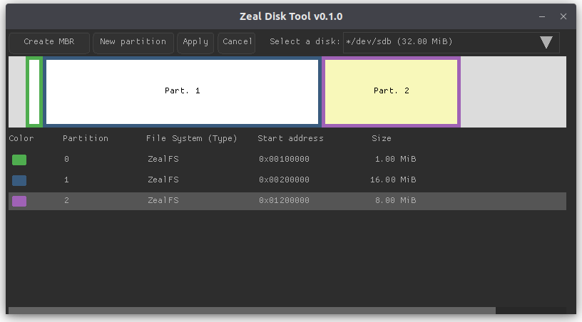

# Zeal Disk Tool

<center>
    
</center>

**Zeal Disk Tool** is a utility to create ZealFS(v2) partitions on disks, such as TF/microSD or CF cards, so that they can be used on Zeal 8-bit Computer.
It provides a GUI to view available disks, view its partitions, and create new partitions.

The current version is compatible with Windows and Linux.

## Features

- View all available disks
- View existing partitions
- Create new ZealFSv2 partitions
- **Changes are cached** and only saved to disk when explicitly applied — prevents accidental data loss
- Cross-platform (Linux and Windows)
- Simple graphical interface built with [Raylib](https://www.raylib.com/) and Nuklear
- To protect internal/unrelated disks, disks over 64GB will be hidden and cannot be modified


> ⚠️ Disclaimer: **Use at your own risk.** Zeal Disk Tool modifies disk images and may interact with physical drives if misused. I am not responsible for any data loss, disk corruption, or damage caused by the use or misuse of this tool. Always back up important data before working with disk images.

## IMPORTANT

On Windows, the program must be executed as Administrator in order to have access to the disks.

Similarly on Linux, the program must be run as root, also to have access to the disks. The program will look for the disks named `/dev/sdx`, make sure the disk you want to manage is mounted under this path in your system.

## Project Goals

The goal of Zeal Disk Tool is to offer a user-friendly, cross-platform graphical interface for creating custom ZealFS partitions on disks. Other partiton/disk management programs don't offer the possibility to create partitions with a custom type (MBR custom type), nor format the partition with a custom file system.

---

## Building

This project has been developed for Linux host initially, but it can also be cross-compiled to target Windows thanks to `i686-w64-mingw32-gcc` compiler.

### Linux (dynamic binary)

#### Compiling the ELF binary

* Install Raylib by downloading the release v5.5. from the [official Github release page](https://github.com/raysan5/raylib/releases/tag/5.5)
* Extract the downloaded archive in `raylib/linux32` or `raylib/linux` directory, for 32-bit or 64-bit version respectively. The structure should look like:
```
├── LICENSE
├── Makefile
├── raylib
│   ├── linux
│   │   ├── include
│   │   └── lib
│   └── linux32
│       ├── include
│       └── lib
├── README.md
├── src
...
```
* Install `gcc` if you don't have it
* Type `make`

That's it, the ELF file `zeal_disk_tool.elf` should be generated!

#### Generating an AppImage

The provided makefile can also be used to generate an AppImage, to do so, install linuxdeploy from [the official Github page](https://github.com/linuxdeploy/linuxdeploy/releases). Then, use the following command:

```
LINUXDEPLOY=<path to linuxdeploy> make deploy
```

For example, if you installed linuxdeploy in the same directory as the makefile, use:

```
LINUXDEPLOY=./linuxdeploy-x86_64.AppImage make deploy
```

### Windows 32-bit (cross-compile static binary on Linux)

* Install Raylib by downloading the release v5.5. from the [official Github release page](https://github.com/raysan5/raylib/releases/tag/5.5)
* Extract the downloaded archive in `raylib/win32`. The structure should look like:
```
├── LICENSE
├── Makefile
├── raylib
│   └── win32
│       ├── include
│       └── lib
├── README.md
├── src
...
```
* Install `mingw` toolchain, on Ubuntu, you can use the command `sudo apt install mingw-w64`
* Type `make zeal_disk_tool.exe`
* Voilà!


## License

Distributed under the Apache 2.0 License. See LICENSE file for more information.

You are free to use it for personal and commercial use, the boilerplate present in each file must not be removed.

## Contact

For any suggestion or request, you can contact me at contact [at] zeal8bit [dot] com

For feature requests, you can also open an issue or a pull request.